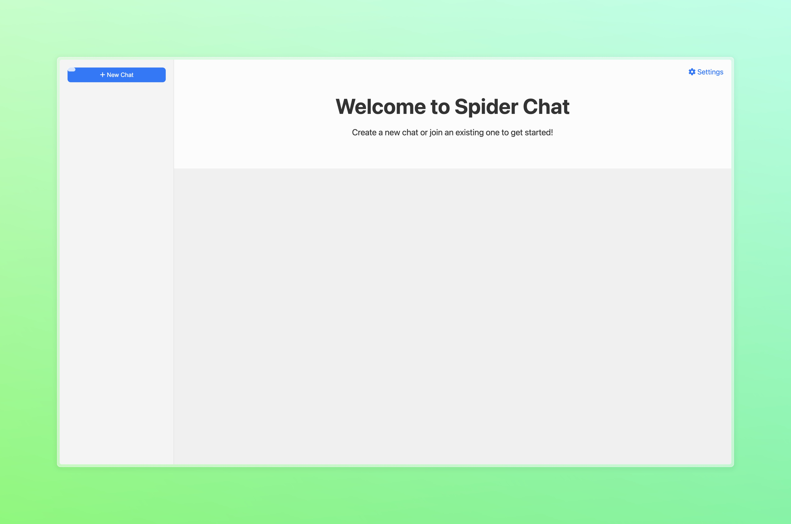

This is the developer documentation for Spider Chat by @codelabsaus

The new and revolutionary peer-to-peer private chat app

**Downloads**

 

ATTENTION!

We are looking for project maintainers. 

[Apply Here](https://forms.gle/QLERUBaKHMC3etsX7)

_________________________________________________________

[Open messages website](https://weblabsaus.github.io/Spider-Chat/)

[Go Local](https://github.com/weblabsaus/Spider-Chat/releases/latest)

[MacOS Installer](https://drive.google.com/uc?export=download&id=1VLCGA_3AxUpxNLbTN_T910tdkHlusrEk)

[Get the chrome extension](https://drive.usercontent.google.com/download?id=1ECjEx1s0OgI_7NCAjmdsUcX4jIroa2By&export=download&authuser=0)

Public Spider Room Code: 52512061

Made with ❤️ by @codelabsaus

[Official Website](https://sites.google.com/view/getspiderchat/home)
