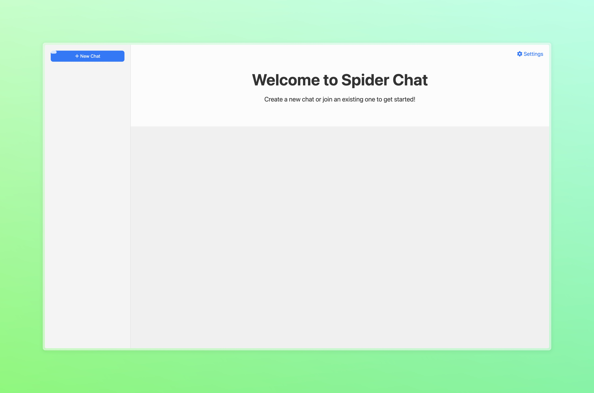

The official page for Spider Chat

The new and revolutionary peer-to-peer private chat app

**Use**

Method 1:

1. Go to messages website

Method 2:

1. Click 'Go local'
2. Download zip.
3. Unzip.
4. Open index.html

Method 3:

1. Download .crx file from the link below
2. Double click
3. You should get an add extension prompt

[Open messages website](https://weblabsaus.github.io/Spider-Chat/)

[Go Local](https://github.com/weblabsaus/Spider-Chat/releases/latest)

[Get the chrome extension](https://drive.usercontent.google.com/download?id=1ECjEx1s0OgI_7NCAjmdsUcX4jIroa2By&export=download&authuser=0)

Made with ❤️ by @codelabsaus

[Official Website](https://sites.google.com/view/getspiderchat/home)
